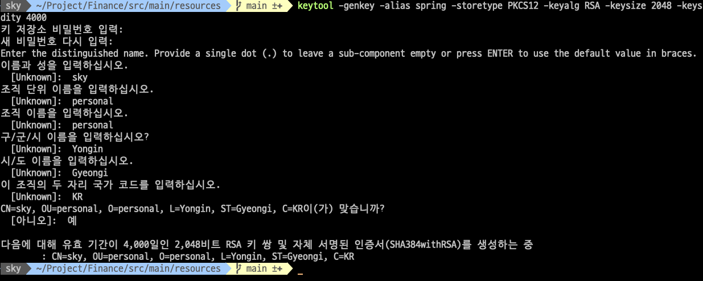
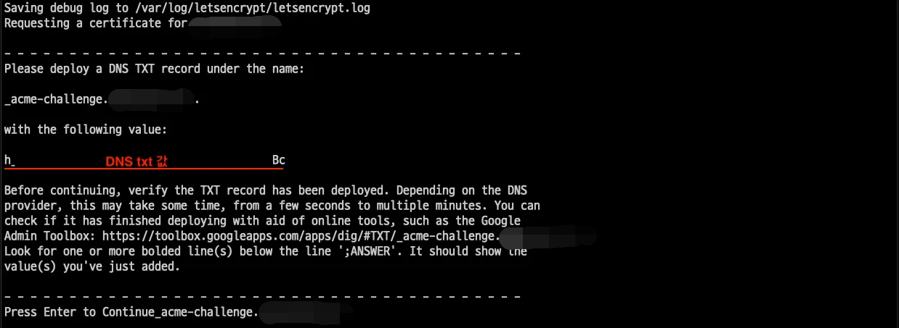

# Code 실행시 사전 설정 사항

## 1. http 또는 https 서비스 설정

### 1.1. http 설정

-   application.yml active를 http로 설정하면 80포트의 http로 설정(Default : http)

    ```yml
    spring:
        profiles:
            active: local, http
    ```

-   application-http.yml에서 Web Server Port 설정(Default : 80)
    ```yml
    server:
        port: 80
    ```

### 1.2 https 설정

-   application.yml active를 https로 설정

    ```yml
    spring:
        profiles:
            active: local, https
    ```

-   https 사용할 ssl 인증서를 생성(방법 2가지)

#### 1.2.1. 가상 인증서 발급법

-   아래와 같이 shell에 명령 입력

    ```shell
    keytool -genkey -alias spring -storetype PKCS12 -keyalg RSA -keysize 2048 -keystore keystore.p12 -validity 4000
    ```

    

    > MacOS 한글 환경으로 인해 마지막 질문에 yes로 영문 입력시 오류 남. 한글로 **예**로 입력 영문은 경우는 **yes**입력

#### 1.2.2. Let's Encryption 인증서를 발급법

-   서비스를 할 서버와 도메인이 필요
-   서비스를 할 서버에 접속 Docker를 사용 인증서를 발급 받음

    ```shell
    sudo docker run -it --rm --name certbot \
                    -v '/etc/letsencrypt:/etc/letsencrypt' \
                    -v '/var/lib/letsencrypt:/var/lib/letsencrypt' \
                    certbot/certbot certonly -d '{보유한 도메인}' \
                    --manual --preferred-challenges dns \
                    --server https://acme-v02.api.letsencrypt.org/directory
    ```

    

    > 실행하면 아래와 같이 출력되며 중간 DNS txt값을 호스팅 업체에 설정해줘야 함

-   Gabia 기준 : 타입은 TXT, 호스트는 \_acme-challenge (도메인주소는 뒤에 있어서 안붙임), 값/위치는 DNS txt값을 입력
    
-   DNS 반영시간이 있기때문에 1~2분 후 Enter
-   /etc/letsencrypt/live/**${도메인}**/ 경로에 fullcahin.pem과 privkey.pem 가 발급
-   생성된 pem 키를 springboot에서 인식가능한 PKC12형식으로 변환
-   live 폴더에 접근 불가시 **sudo -i** 또는 **root** 계정으로 접근

    ```shell
    sudo openssl pkcs12 -export -in fullchain.pem -inkey privkey.pem -out keystore.p12 -name ttp -CAfile chain.pem -caname root
    ```

-   생성된 keystore.p12 파일 /src/main/resources 폴더 아래 복사
-   application-https.yml 파일에 key-store-password에 키 생성시 사용한 아이디, 비밀번호 입력
    ```yml
    server:
    port: 443
    ssl:
        enabled: true
        key-store: classpath:keystore.p12
        key-store-password: 123456
        key-store-type: PKCS12
        key-alias: spring
    ```
-   key-alias는 생성 방법에 따라 아래 표처럼 생성 다름
    | 1. keytool로 임시키 생성 | 2. Let's Encryption 키 생성 |
    |-|-|
    |`key-alias: spring` | `key-alias: tomcat` |

## 2. Oauth2 사용 설정

-   사전에 Kakao, Google등 OAuth2 제공자에서 OAuth2 애플리케이션을 생성해야 함
-   본 프로젝트는 Google Cloud의 API 서비스를 통해 프로젝트를 생성([Google OAuth2 문서](https://developers.google.com/identity/protocols/oauth2?hl=ko))
-   Code에는 application-oauth가 누락되어 있음
-   /src/main/resources 폴더 아래에 application-oauth.yml 작성해 추가
-   application-oauth.yml 샘플
    ```yml
    spring:
        security:
            oauth2:
                client:
                    registration:
                        google:
                            client-id: #google client id
                            client-secret: #google client password
                            scope: profile,email
                            redirect-uri: "{baseUrl}/login/oauth2/code/{registrationId}"
                            authorization-grant-type: authorization_code
                    provider:
                        google:
                            authorization-uri: https://accounts.google.com/o/oauth2/auth
                            token-uri: https://oauth2.googleapis.com/token
                            user-info-uri: https://www.googleapis.com/oauth2/v3/userinfo
    ```

## 3. 배포시 DB 환경 사용 설정

-   application.yml active가 local인 경우는 개발환경으로 사용
-   Cloud등 환경에서 배포하기 위해서는 local 대신 cloud로 설정

    ```yml
    spring:
        profiles:
            active: cloud, http
    ```

-   application-cloud.yml에 있는 3가지 항목을 다음 표를 참고해서 .zshrc 혹은 .bashrc에 환경변수 설정

    | 환경변수명             | 설정값(예시)                      |
    | ---------------------- | --------------------------------- |
    | ${POSTGRESQL_HOST}     | export POSTGRESQL_HOST=1.1.1.1    |
    | ${POSTGRESQL_USER}     | export POSTGRESQL_USER=username   |
    | ${POSTGRESQL_PASSWORD} | export POSTGRESQL_PASSWORD=123456 |

-   아래 명령을 수행하여 환경 변수 적용

```zsh
source ~/.zshrc

# echo를 사용 확인
echo ${POSTGRESQL_HOST}
1.1.1.1
```

## 4. Elastic Search 연동

-   현재는 localhost로 연동

    ```yml
    spring:
        elasticsearch:
            uris: http://localhost:9200
    ```

-   **krx_listed_data** 명으로 미리생성해야 함
-   kibana Dev Tools를 사용해서 생성

    ```kibana
        put /krx_listed_data
    ```
